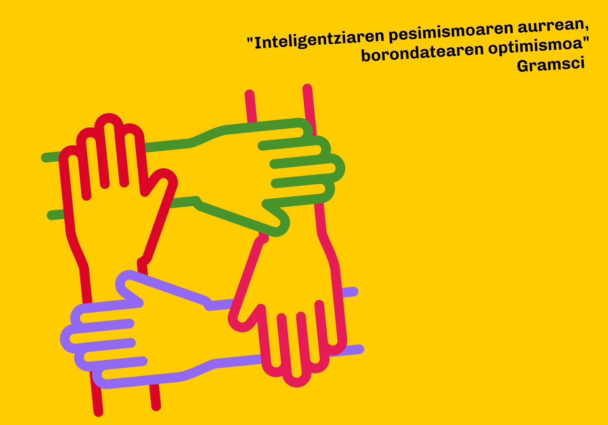

**Euskera** | [Castellano](es)

<a href="https://forms.gle/q3ou5UES1ywUtMqH9" class="pressbutton" style="text-align:center;background-color:#fc0;padding:10px;border-radius:4px;color:black;text-decoration:none;cursor:pointer;">Sinatu hemen zerrenda bateratuaren alde</a>

# Saia zaitezte berriro! 
## Podemos Euskadi, Sumar Mugimendua, Ezker Anitza-IU eta Equo-Berdeak alderdien arteko zerrenda bateratuaren aldeko sinadura bilketa

Balio eta programa berdinzaleak, ekologistak, feministak, bakezaleak, federalistak, internazionalistak... partekatzen ditugun euskal herritarrak garen einean, kezkaturik gaude erakunde horiek urteetan partekatu duten esparru politiko komunaren haustura aurreikuspenaren aurrean. Aliantza hori hautsita, ahuldu egiten dira Euskadirako gure proposamen sozial eta ekonomikoak bultzatzeko aukerak.

Baina oraindik garaiz gabiltza. Erakunde horiek guztiek diote atea zabalik dutela euskal hauteskundeetan elkarrekin parte hartzeko. Eta hauteskundeak ez dira deitu, eta behin eginda, oraindik egun batzuk geratuko dira koalizioak egiteko.

Horregatik, erakundeei dei egiten diegu berriro saia daitezen, berriro bil daitezen, eta bideratzaile batzuek lagunduta, eskuzabaltasunez eta errealismoz gaindi ditzaten beren desberdintasunak, eta, horrela, espazio honek osatutako aniztasunaren pareko hauteskunde batasuna lor dezaten.

Eta horretarako sinatzen eta zabaltzen dugu aldarrikapen hau.

## Sinatzaileen zerrenda
* Imanol Zubero Beaskoetxea (Soziologoa)
* Itxaso Alonso Arana (Funtzionario)
* Loic Alejandro (Autonomoa)
* Iker Bereciartua Castrillo (Berdeak Equo)
* Mentxu Ramiro Araujo (Profesional independientea)
* Eder Alvarez Rivera (Politologoa)
* Andoni Basterra Urrutia (Sindikalista)
* Enrique Olaso García (Irakaslea)
* Igone Arteagabeitia Chavarri (Erretiratua)
* Juan Barredo (EHU)
* Eder García López (Zinegotzia Elkarrekin Sopela)
* Ana María López Cubilla (HEOI Irakaslea)
* Jose Alvarez (Independiente)
* Jon Bernat Zubiri Rey (Podemos eta Sumar-eko militantea)
* Ángel Bao Pérez (Sumar/Ezker Anitza-IU)
* Alvaro López (Ingeniaria)
* Nour Edin (Obrero, Ezker Anitza-IU)
* Manuela Ruiz Vivanco (Erretiratua)
* Ekaitz Cancela (Ikertzailea)
* Laura B.S. (Irakaslea)
* Antonio Duplá Ansuategui (Irakaslea UPV/EHU)
* Araceli Ruiz (Sindikalista)
* Antonio Valcuende (Ingeniaria)
* Santi Martínez (Sindikalista)
* Begoña Zubiri Cearra (--)
* Enrique Goikoetxea Iturregi (CCOO)
* Amaia González Llama (Soziologoa)
* Iñaki Markez Alonso (Psikiatra, Ikertzaile soziala, OME-AENeko kidea)
* Alvaro Martín Estefania (Irakaslea)
* Nuntxi Sancho Valdivielso (Irakasle erretiratua)
* Marijo Madariaga Rola	(Erretiratua)
* Iker Bartolomé Nieto (Ezker Anitza-IU Ortuella)
* Arantza Urcelay Salcedo	(Erretiratua)
* Iñaki Valentín Pérez (talde sozialetan militantea)
* Casimiro Castaño González (Ezker Anitza-IU)
* Israel Escalante Mesón (IU-ko militantea)
* Asier Hernández Juanes (Ingenieari Informatikoa)
* José Manuel Ferradás (Kazetaria)
* Ekain Larrinaga Muguruza (Inmigrazio Teknikaria)
* Aitor Mingo (Berdeak Equo)
* David Rengel Larrea (Ikertzailea)
* Iñaki Prieto Duñabeitia (Irakasle erretiratua)
* M. Pilar Cidal López de Torre (Psikologoa)
* Adrián Vázquez (Ezker Anitza-IU)
* Raimundo Rubio Carcedo (Podemos Portugalete) 

<meta property="og:title" content="elkarrekinsumarbai">

