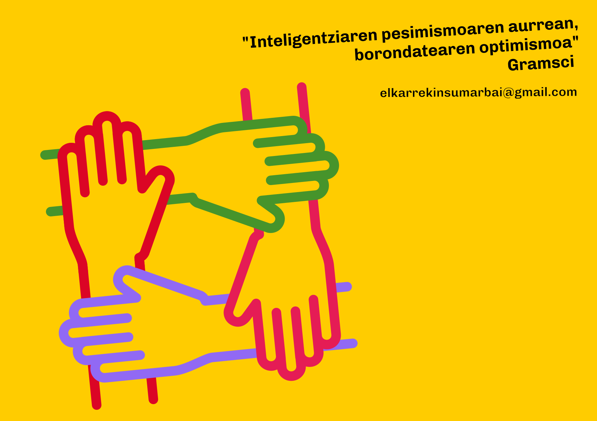

[Euskera](/) | [Castellano](/es) | <a href="mailto:elkarrekinsumarbai@gmail.com">Kontaktua - Contacto</a>

# Jasotako iruzkin sorta / Muestra de comentarios recibidos

Batasuna lortu behar dugu, denon artean

Por supuesto que merece la pena unir fuerzas para poder seguir teniendo alguna capacidad de influencia social y política, en definitiva, para poder intentar mejorar la vida de las personas. Por separado es seguro el papel residual. Humildad.

Politikan bihotza beharrezkoa da, baina burua erabiltzea ere ezinbestekoa.

Intentemos no dividirnos :)

faborez, mesedez, arren, otoi

No nos dejéis huérfanos!!

Lortuko dogu

Frente Amplio, por separado no nos representan.

Absolutamente necesaria la iniciativa

Sino hay unión la izquierda federalista desaparece. Urge acudir juntas a las elecciones. Tenemos una oportunidad para cambiar el gobierno y hacer política progresista para mejorar la vida de las personas.

Por una izquierda fuerte y unida

En la unión está la fuerza

UHP

Pero, es que no se les ocurre a ellos?

Por un proyecto unitario que nos permita avanzar en la transformación social

La unión hace la fuerza 

La unidad es imprescindible

Askotariko batasunaren alde.

Por favor, necesitamos una candidatura unitaria!

No hay argumentos políticos para que vayan separados.

Ánimo, y que no se pierdan votos de la izquierda por atomización 😔

Tras la asamblea de ayer, creo que es muy positivo dar el paso impulsado y que este pueda darse sin poner de inicio zancadilla alguna. Hay que ser constructivos y dejar poner el pie en el suelo. Si ese paso es hacia adelante o hacia atrás, el tiempo lo dirá.

Muchas gracias por poner en marcha esta iniciativa. Aún estamos a tiempo.
Desde el respeto a la realidad vasca, la unidad es posible y necesaria. No dejemos que la ruptura del espacio a nivel Estatal se imponga en Euskadi. Todavía podemos convencer a aquellos que desean un reordenamiento monolítico del espacio, de que en Euskadi podemos hacer las cosas de otra manera. El "borrón y cuenta nueva" no ha funcionado en Madrid, tampoco lo hará aquí. 
La solución al conflicto debe ser democrática, en base a la participación popular. El futuro de nuestro espacio político está en juego.
Elkarrekin Sumar BAI! :)

Ezinbestekoa unitaria, bestela porrota!!!

Unidad plural de la izquierda

La unidad es imprescindible, no nos falléis.

Sí se puede!

Ya vale del "yo,mi,me,conmigo". Es necesario.

No hay que intentarlo, hay que HACERLO. 

Evitemos personalismos y prioricemos el fin del PNVrato.

Unidad para mantener un espacio electoral en la izquierda no nacionalista

Todas y todos debemos tener una organización unitarias con cauces democráticos interno de respecto ante la diversidad

Si no vais unidos, mi  voto útil será  EHBildu, a pesar de haber participado en la ley de educación. Es un gran error ir por separados, os señalaré como culpables.

Me parece esencial ir como lista única tanto por aumentar posibilidades de gobernabilidada como por la propia ideología que sea plural

Estoy por la unión, separados es como ir a suicidarse. No más personalismos.

Edo batzen gara Edo ez gaude.

Si la izquierda no vamos unidos lo pasaremos muy mal

Si no es posible ir juntas en una lista, apaga y vamonos

Unios

Viva la unidad, de la diversidad

Ea lortzen dugun

Elkartuta hobeto

Creo que más allá de la búsqueda de acuerdos para la lista electoral, se debe trabajar por el reconocimiento de todos. Me gustaría trabajar en eso y si se ve adecuado me centraría en eso

A favor candidatura unitaria

Podemos no es un partido cualquiera, hemos hecho Historia en nuestro país, pero todavía no hemos entendido, que la única vía de lucha en el Siglo XXI es el diálogo y nuestra mejor arma, poder estar en coalición, para acabar con bipartidismos de Estado, ahora es el momento. Dejemos atrás los egos y caminemos juntos para avanzar, demostrando que SÍ SE PUEDE. 

Quiero que se pongan las pilas los de sumar

Haremos más fuerza. Multiplicaremos. Si no vamos a dividir. Dividendonos vencerán los otros 

Esta absurda división resta credibilidad a los 2 partidos y quita las ganas de votar

Batasunaren alde. BAI.

Unidad de la izda internacionalista vasca

Salud y República

Escéptico para con el resultado a corto plazo, pero convencido de la necesidad de la unión confederal de las izquierdas plurales y diversas en colaboración por el metodo democratico y la limitación y rotación de mandatos/representantes. Apoyo la iniciativa.

Juntos sumamos más 

Política es compromisos, y deja los egos aparte para trabajar por un bien comun

Unidos o desastre 

Denok batera / Todos a una 

Si firmo por la unidad plural 

Si quiero la unidad plural

Una izquierda MÁS fuerte y consolidada, si se puede!

Estoy inscrito en Podemos y lo que esta pasando es una puta vergüenza. Por los egos de algunas personas la izquierda se va al carajo. Por mi parte, si no hay unión voy a hacer lo que nunca hubiera imaginado, votaré a Bildu, de esa manera mi voto no irá a la basura que es lo que ocurrirá si lo hago a SUMAR, PODEMOS...

Banatuta izugarrizko porrota!!!!!!

Necesitamos una izquierda unida para hacer un mundo más justo y mejor. No tiene sentido que los personalismos se impongan a las ideas. No hay tantas diferencias ideológicas. Hay que recuperar el espíritu del 15-M.

Porque soy de izquierdas y la formación a la que pertenezco siempre ha apostado por la unidad de la misma. Por ello siempre estaré en ella.

Unidad  con la finalidad de eliminar la corrupción.

Elkarrekin Sumar Bai beti

Sin unidad no vamos a ningún lado, basta ya de personalismos

Se debe recuperar la ilusión, más allá de personalismos y divergencias egoístas

La división  del progresismo refuerza el "regresismo"...más eCosistema y menos eGosistema.

Esperemos que se consiga

<meta property="og:title" content="elkarrekinsumarbai">

