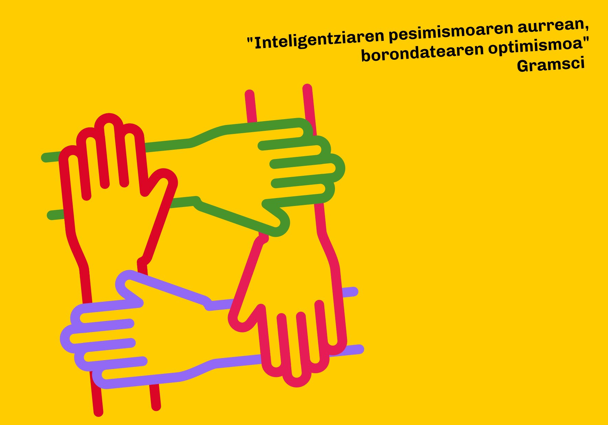

[Euskera](/) | **Castellano**

<a href="https://forms.gle/q3ou5UES1ywUtMqH9" class="pressbutton" style="text-align:center;background-color:#fc0;padding:10px;border-radius:4px;color:black;text-decoration:none;cursor:pointer;">Firma aquí por la lista unitaria</a>

# ¡Intentadlo otra vez!
## Recogida de firmas por una lista unitaria entre Podemos Euskadi, Sumar Mugimendua, Ezker Anitza-IU y Equo-Berdeak

Como ciudadanos y ciudadanas vascas que compartimos valores y programas igualitaristas, ecologistas, feministas, pacifistas, federalistas, internacionalistas... asistimos con preocupación a la anunciada fractura del espacio político común que estas organizaciones han venido compartiendo durante años. Con la ruptura de esa alianza se debilitan las posibilidades de impulsar nuestras propuestas sociales y económicas para Euskadi.

Pero aún estamos a tiempo. Todas estas organizaciones dicen mantener la puerta abierta a concurrir conjuntamente a las próximas elecciones vascas. Y los comicios no se han convocado, y una vez se haga, quedarán todavía varios días para formalizar coaliciones.

Por eso apelamos a las organizaciones para que lo vuelvan a intentar, para que se reunan otra vez, y para que acompañadas de algunas personas facilitadoras, superen con generosidad y realismo sus diferencias, y consigan así una unidad electoral a la altura de la pluralidad social que conforma este espacio.

Y para eso firmamos y difundimos esta reclamación.

## Listado de firmantes
1. Imanol Zubero Beaskoetxea (Sociólogo)
1. Itxaso Alonso Arana (Funcionaria)
1. Loic Alejandro (Autónomo)
1. Iker Bereciartua Castrillo (Berdeak Equo)
1. Mentxu Ramiro Araujo (Profesional independiente)
1. Eder Alvarez Rivera (Politólogo)
1. Andoni Basterra Urrutia (Sindicalista)
1. Enrique Olaso García (Profesor)
1. Igone Arteagabeitia Chavarri (Jubilada)
1. Juan Barredo (EHU)
1. Eder García López (Concejal Elkarrekin Sopela)
1. Ana María López Cubilla (Profesora EOI)
1. Jose Alvarez (Independiente)
1. Jon Bernat Zubiri Rey (Militante de Podemos y de Sumar)
1. Ángel Bao Pérez (Sumar/Ezker Anitza-IU)
1. Alvaro López (Ingeniero)
1. Nour Edin (Obrero, Ezker Anitza-IU)
1. Manuela Ruiz Vivanco (Jubilada)
1. Ekaitz Cancela (Investigador)
1. Laura B.S. (Docente)
1. Antonio Duplá Ansuategui (Profesor UPV/EHU)
1. Araceli Ruiz (Sindicalista)
1. Antonio Valcuende (Ingeniero)
1. Santi Martínez (Sindicalista)
1. Begoña Zubiri Cearra (--)
1. Enrique Goikoetxea Iturregi (CCOO)
1. Amaia González Llama (Socióloga)
1. Iñaki Markez Alonso (Psiquiatra, Investigador social, Miembro de OME-AEN)
1. Alvaro Martín Estefania (Profesor)
1. Nuntxi Sancho Valdivielso (Profesora jubilada)
1. Marijo Madariaga Rola	(Jubilada)
1. Iker Bartolomé Nieto (Ezker Anitza-IU Ortuella)
1. Arantza Urcelay Salcedo	(Jubilada)
1. Iñaki Valentín Pérez (militante en colectivos sociales)
1. Casimiro Castaño González (Ezker Anitza-IU)
1. Israel Escalante Mesón (Militante de IU)
1. Asier Hernández Juanes (Ingeniero Informático)
1. José Manuel Ferradás (Periodista)
1. Ekain Larrinaga Muguruza (Técnico inmigración)
1. Aitor Mingo (Berdeak Equo)
1. David Rengel Larrea (Investigador)
1. Iñaki Prieto Duñabeitia (Profesor jubilado)
1. M. Pilar Cidal López de Torre (Psicóloga)
1. Adrián Vázquez (Ezker Anitza-IU)
1. Raimundo Rubio Carcedo (Podemos Portugalete)
1. Sabin Zubiri Rey (Activista social, sindical y político)
1. Miguel Virizuela Echaburu (Jubilado)
1. Eduardo Calvo González (Simpatizante)
1. Irene Euba Arroyo (Ezker Anitza-IU)
1. Carlos Becerra Villar (Funcionario jubilado/Ezker Anitza-IU)
1. Eneida de la Iglesia Vélez (Ezker Anitza-IU)
1. Ricardo San Segundo (Jubilado)
1. José Simón (Jubilado) 
1. Cristina Torre Azpitarte (Limpieza)
1. Luis Arbide González (Activista)
1. Juan Antonio Jericó Fernández (Equo Berdeak)
1. Jorge Barrón Fernández (OSALDE, Organización para la Defensa del Derecho a la Salud, País Vasco)
1. Roberto Sainz Sainz	(Trabajador)
1. Asier Rodriguez Villa	(Derechos Humanos)
1. Xabier Martín Corcuera (Médico)
1. Andrea Ruiz Balzola	(BEGIRUNE Fundazioa)
1. Estibaliz Kortazar Errekatxo (Elkarrekin sumar bai)
1. Román Rodríguez Calleja	(Más Euskadi-Euskadi Eraiki)
1. Gotzon García Goti (Profesor)
1. Beatriz Marquina Garcia (Intervención social, movilidad humana)
1. Xabier Andrés Uriarte	(Funcionario)
1. Luis Miguel Gorostiaga Alonso	(Independiente)
1. Lourdes Oñederra (Lingüista-Escritora)
1. Ander Valentin Aparicio	(Estudiante)
1. Rakel Arana Martinez (Profesora)
1. Nicolás Martín Corcuera (--)
1. Andoni Berroeta (Estudiante)
1. Begoña Sanchez Villa (Trabajadora social)
1. Richar Vaquero Moreno (Juntero de Elkarrekin Bizkaia, Militante de Podemos)
1. María Concepción Rodríguez Pastor	(Podemos)
1. Guillermo Presa	(Podemos Euskadi)
1. Josep Moya Albarracín (CCOO)
1. José Joaquín González Uribarri (Jubilado)
1. Nerea Aresti Esteban	(Historiadora, feminista)
1. Tere Maldonado Barahona	(Profesora)
1. José María Barandiaran Galdós (Jubilado)
1. Iker Mojón (Periodista)
1. Eneritz de Madariaga Martin	(Podemos)
1. Alberto García Fernández (Administración Pública)
1. Hortensia Alda Serrano (Graduada Social)
1. Marcos López Medina (Desarrollador Web)
1. Alberto de la Iglesia Vega (Osakidetza)
1. Emilio Ordóñez Sancho-Miñano (Jubilado)
1. Gemma Zubiaurre Urkiri (Profesora jubilada y Sumar Mugimendua)
1. Germán García Marroquín	(Jubilado)
1. Alfredo Herbosa López (Jubilado)
1. Koldo Unceta (Catedrático jubilado UPV/EHU)
1. Miren Yosu Gregorio Espinosa (Ezker Anitza/Izquierda Unida)
1. Araceli Jiménez Esquilas (Pensionista)
1. Monica Calvo Badia (Ingeniera)
1. Carlos Asensio Álvarez (Ezker Anitza-IU)
1. David Alday San Cristóbal (Educador)
1. Leticia Jiménez Loza (Administrativa)
1. Ana Belén Peralta Flores (Trabajadora social)
1. Asun Merinero Sierra (Historiadora, ex juntera de Podemos Euskadi)
1. Victoria Lamas Veiga (Jubilada)
1. Adrián Medrano (Programador cultural/ hostelero)
1. Sergio Gonzalez Miguel (Sindicalista)
1. Virginia Medina Alvarado (Jubilada y ciudadana preocupada)
1. Rafael Garde Vicinay (Podemos)
1. Alberto García Cortés	(--)
1. Gaizka Esparza (Periodista)
1. Juan Agustin Aizpuru Izaguirre	(Usansolo Herria)
1. Ignacio Garay (Profesor)
1. Luis Alejos	(Podemos Bilbao)
1. Fidencio Bao Pérez (Osakidetza)
1. Ana Martín (Combatiente por la justicia social)
1. Rubén Belandia Fradejas (Bibliotecario y militante de Podemos)
1. Cristina Sánchez Isasi (Educadora)
1. Susana Carro Ripalda (Antropóloga, independiente)
1. Imanol Ziarsolo	(Jubilado)
1. Iker Atxaga Gallo (Vigilante)
1. Puri Perez Rojo (Pensionista)
1. Jose Ramon Iñurrategui Pagalday (Jubilado)
1. Concha Castells (Independiente)
1. Catalina Gómez Arango (--)
1. Margarita Toja Garamendi (Mungia Alkartu)
1. Jon Ander Tapia Bujan (Berdeak Equo)
1. Lala Juaristi Linacero (Jubilada y miembro de Podemos)
1. Iratxe Amantegi (Trabajadora social)
1. Nekane Santos Tijero (Alimentadora felina y dentro del programa CER Ayuntamiento Bilbao)
1. Francisca Sánchez Salinas	(Jubilada)
1. Alazne Cuellar Prieto (Educación infantil)
1. Roberto Navarro Antoñanzas (Profesor)
1. Aurkene Ureta	(Administración)
1. Itziar Abad Ramírez	(Técnica de Igualdad)
1. Nieves Viloria Otxaran (Ingeniera)
1. Markel González Zelaia-Zugadi (CC.OO/IU)
1. José Luis Ruiz (Jubilado)
1. Javier Larrinaga Uriarte (--)
1. Charo Muguruza Urkiola (Jubilada)
1. Raúl Mariano López Tocci (Psicólogo social)
1. Juan Carlos Martín Quicios (Más Euskadi-Euskadi Eraiki)
1. Matías Vaquero Vicente (Elkarrekin sumar)
1. Roberto Gallo (Privada)
1. Ana Imaz Llano (Psicologa/Ezker Anitza)
1. Eduardo Urturi Martìnez (Goiener)
1. Pablo Fernández Mezo (Concejal de Elkarrekin Sestao)
1. Ana Laura López (Pensionista)
1. Francisco Antonio Rodríguez Velasco	(Portavoz Podemos Urduliz)
1. Fabio Cavaliere (Más Euskadi)
1. Isidoro Lozano (Educador Social)
1. Ruth Herrera Manzanera (Cartera)
1. José Gómez Cabrera (Jubilado)
1. Isabel Urkijo Azkarate (--)
1. Pilar Barraqueta Egea (Biologa)
1. Juanan Urkijo Azkarate (Jubilado)
1. Juan Luis Uria Serrano (OSALDE, Asociacion por el derecho a la salud)
1. Idoia Martínez de Murgia (Profesora)
1. José Alfonso Antequera Chavéz	(Basauri)
1. Begoña Morote Segurola (de izquierdas y contra el capitalismo)
1. Maria Begoña Iriarte Campo (Psicologa)
1. Miguel Aranburuzabala	(UPV-EHU)
1. Ander Gutiérrez-Solana (Profesor UPV/EHU)
1. Nieves Terán (Ciudadana)
1. Rosa Igartua (Jubilada)
1. Pablo Larrauri (Podemos)
1. Gentzane Madariaga Martin (Educadora social)
1. Elena Aizpitarte Larrañaga (Profesora)
1. Ricardo Antón Troyas (des-artista)
1. Montse Viloria (Educación)
1. Isabel Ortiz de Urbina Arruabarrena (Profesora jubilada)
1. Maite Martínez (Profesora jubilada)
1. Beatriz Muñoz Liedo (Educación Social)
1. Amelia Escolano Bernabe (TCAE)
1. Miguel Mata Gonzalez (Ex responsable territorial de CC.OO. en Bizkaia)
1. Mikel Barba del Horno (Profesor)
1. Amparo Iriarte Campo (--)
1. Miren Llona (Feminista)
1. Rosa María Castro Martinez (Técnico)
1. Bingen Villate Ezquerra	(AILEDI comunidad cristiana)
1. Gaizko Urturi Aldama (Profesor)
1. Iñaki Acha Oñate (Pensionista/Podemos)
1. Diego Aviles (PCE-EPK/EZKER ANITZA/CC.OO.)
1. Ana Cobo Gomez (Trabajadora social)
1. Oskar Moreno Alonso (Pensionista)
1. Arantza Maguregui Rodríguez (Jubilada)
1. Karmele Aza Barruetabeña (Activista feminista)
1. Juan Pablo Ibarra Cárcamo (Economista, jubilado)
1. Pedro Torralba (Jubilado)
1. Damian Rodriguez Velasco (Informático)
1. Raisa Iratxe García Isasa (Berdeak EQUO)
1. Josetxu Tapia Astobiza (Profesor jubilado)
1. Laura Yanguas Aguirre (Jurista y militante del quinto espacio político)
1. Pablo García de Vicuña Peñafiel (CCOO Irakaskuntza)
1. Genma Sánchez Mugarra (Jubilada)
1. Jesus Herrero Arranz (Ingeniero informático)
1. Yolanda Rezola Salvador (Pensionista)
1. Susana Andollo Gonzalez (Ex Podemos)
1. Xabier Askasibar Renobales (Profesor)
1. Josune Urquijo Muruaga (OEE)
1. Endika Etxeandia (Jubilado)
1. Clara Murguialday (Feministas por Nicaragua)
1. Diego Fuentes Luque (Podemos)
1. Rosa Axpe Pascual (Osakidetza, jubilada)
1. Luis E. Alegre Arteche (Jubilado)
1. Iñaki Andres (Jubilado)
1. Txema Cifuentes Costela (Profesor jubilado)
1. Montserrat Marañon Martinez (Pensionista) 
1. María Isabel García García (Profesora, IU/Ezker Anitza)
1. Oskar Arenas Velasco (Sindicalista CCOO de Euskadi)
1. Joseba Andoni Duoandikoetxea Zuazo (Jubilado)
1. Elisabet de Paz Suárez (Profesora)
1. Aritz Zabala Iturbe (Auxiliar administrativo)
1. Marije Goikoetxea Iturregui (Profesora Etica Universidad de Deusto)
1. Sonia Galiana Saiz (Funcionaria)
1. Paco Castells Carrilo (Jubilado)
1. Jesús Muro Gastañaga (Jubilado)
1. Pilar Alegría Iscoa (Jubilada)
1. Joseba Elorrieta Mendiola	(Trabajador)
1. Juan Manuel Belamendia Belda (Más Euskadi-Euskadi Eraiki)
1. Maria Jose Sola	(Bibliotecaria/feminista)
1. Victoria Párraga Tello (Enseñante)
1. Luisa Menendez Agirre (Feminista)
1. Iñaki Bolibar Garmendia	(Arquitecto)
1. José Luis Gómez Ledesma (Podemos)
1. Marta Ferrer Gutierrez (Responsable de Recursos Humanos y Legal)
1. Fabián Laespada Martinez (Profesor)
1. Maika Lolo López (Profesora)
1. Ángel Pérez Butrón (Jubilado)
1. Christian Bolaños	(Desarrollador de software)
1. Isabel Llorente Fernandez de Nograro (Funcionaria)
1. Eider Berazadi Aramendi (Profesor)
1. Nieves Miguel Izquierdo (Jubilada)
1. Guillermo Ruiz Irastorza (Médico de Osakidetza)
1. Jon Korta Murua (Trabajador)
1. Marian Arbide Basterrechea (Feminista)
1. María Milagros Resa Santamaría (Jubilada)
1. Garbiñe Santa Coloma (Más Euskadi)
1. Pablo Bocca (EPK-PCE Gasteiz, Funcionario Público)
1. Alfonso Fernández (Jubilado)
1. Juantxo Domínguez (Miembro de Sumar y Podemos Euskadi)
1. Juan Luis Lugarezaresti Goikoetxea (Jubilado)
1. Jose Pérez Bilbao (Por libre)
1. Estibaliz Urkijo Azkarate (Trabajadora Social)
1. Tomás Armán García (Informático)
1. Arantza Semprun (Ezker Anitza-IU, CCOO, irakasle ohia)
2. Itziar Villanueva Etxeberria (Profesora)
3. Josefa Martin San frutos (Jubilada)
4. Javier Losa Vega (--)
5. Begoña Martín San frutos (Jubilada)
6. Araceli C. Diez López (Responsable de Comunicación)
7. Miren Begoña Sasia Santos (Profesora)
8. Jaione de la Puerta Sasia (Profesora)
9. Eduardo Sánchez Pérez (Economía solidaria)
10. Teresa López Saiz (Administrativa Osakidetza)
11. Sara Castro Fuentes (Profesora)
12. Pello Gutiérrez Salceda	(Enfadado por el desencuentro)
13. Mª Carmen Fernández (Jubilada)
14. Xabier Laka Antxustegi (artista y profesor)
15. Gurutze Maguregi-Gonzalez (profesora jubilada UPV/EHU)
16. Manuel Casado Ramírez (Jubilado)
17. Itziar Cabieces Ibarrondo (Osalde, defensa de la Sanidad Publica)
18. Gorka Eizaguirre Bilbao (profesor)
19. Jose Manuel Susperregi Martin	(LSB-USO)
20. Esther Mendiaratz Jiménez (Diplomada en masaje)
21. Santiaho Patino Sanchez	(Jubilado)
22. Carlos Ortigosa Villarejo	(Profesor jubilado de EE. MM.)
23. José Miguel Gonzalez de Audicana (Jubilado)
24. Lidia Muñoz Ucher	(Berdeak Equo)
25. Miguel Burdallo Bautista (Ezker Anitza-IU)
26. Aurelio González Somavilla (Equo Berdeak)
27. Gorka Nogal Laguna (Jubilado)
28. Juanjo Vallejo García (Ezker Anitza IU)
29. Carlos Pérez (Profesional independiente)
30. Imanol Martín Prieto (Ezker Anitza, politólogo y encargado de una pastelería)
31. Alicia Robles Alonso (Inscrita Podemos)
32. Irene Espinosa Cid (Jubilada)
33. Iñaki Aristondo (Arquitecto)
34. Mikel Olabe (Jubilado)
35. Enrique Marcos (Delegado CCOO, IU)
36. Pedro Huidobro González (--)
37. Marbel Pizarro Pacheco (Psicologa en entidad social)
38. Asier Tapia Gutiérrez	(Algo)
39. Ángel Calvo Pelaez (Desencantado)
40. Javier Zabala Lahoz (Jardinero)
41. Koldo Pardo Hernández (Docente)
42. Ane Alonso Mendez (Arquitecta)
43. Jose Antonio Madrazo Gomez (Educación, Jubilado)
44. Iñaki Barba Navaridas (Jubilado)
45. Pepe San Jose Mendo (educador social)
46. David Martínez Zabalo	(Jubilado)
47. Rafa Pérez Beristain (Trabajador)
48. Julia Monge Sarabia	(Feminista)
49. Virginia García (Técnica de Podemos)
50. Roberto Herbosa López	(Jubilado)
51. José Luis Lopez Rivas (Solidaridad Pueblo Saharaui)
52. Maria José Garcia	(Jubilada)
53. Mikel Andrés Uriarte (Empleado)
54. Josu Calabria Gomez	(Operario Metal-aeronautica)
55. Candi Lorenzo Pérez (Profesora jubilada)
56. Juan Carlos Hernández García (Maquinista Euskotren)
57. Begoña Aspuru Soloaga (Educadora Social)
58. Irkus Larrinaga (Izquierda Unida)
59. Iñigo Leon Sancho	(Berdeak-EQUO)
60. Juan Carlos Melero Ibáñez (Psicólogo) 
61. José Ignacio Trasancos Alonso (Simpatizante IU)
62. Antonio Jiménez Roncero (Profesor jubilado)
63. Ibai Las Heras Murguia (Profesor)
64. Olga López Angulo (Ej-Gv)
65. Kattalin Garmendia Etchenique (--)
66. Eloy Marteache Azcoaga (Podemos Mondragon)
67. Juan Antonio Antolín Iría (PCE/EPK-Ezker Anitza)
68. Idoye Zabala Errazti (Profesora agregada UPV/EHU, jubilada)
69. Josu Mesa	(Bizizale)
70. Jesús Angel Miranda Aretxabala	(Médico jubilado)
71. Beatriz Gomendio Tello (Abogada)
72. Mitxel Urkijo Martínez (Jubilado)
73. Carlos Saez de Lafuente Zabala (OEEB)
74. Mikel Orrantia (Jubilado, activo en redes sociales y mucho más)
75. José Vicente Cos Villegas	(PCE-EPK, Elkarrekin Podemos, Artista responsable de la sala de exposiciones ¶espazioa)
76. Susana Aranburu Sanz (Farmacia)
77. Gregorio Martin	(a favor de l@s trabajador@s)
78. Andoni Mendiaratx Jimenez (Pensionista)
79. Pedro Valdés Larrañaga (Jubilado)
80. Gonzalo Arranz Ayala (Periodista)
81. Jose Luis Salió Casquero (Jubilado)
82. Asier García Lupiola (Profesor EHU)
84. Beñat Alonso (Ezker Anitza-IU Sestao)
85. Ubaldo Ortiz Rodrigo (Ezker Anitza-IU)
86. Olga Morales Vallejo (--)
87. Jesus García San José (Sindicalista)
88. Cris López (Ecofeminista abolicionista)
89. Daniel Domínguez Henche (Profesor)
90. Christoph Kleeberger (Equo)
91. Blanca Martínez Bellido	(Psicóloga)
94. Jon Mikel Seijo Arrinda (Jubilado)
95. Begoña Mendia Ibarrola	(Jubilada)
96. Xabier Sobrino Alonso (Profesor Economía)
97. Carmen Kortazar Lapeyra (Jubilada)
98. Jorge Azcona Garcia	(Funcionario Seguridad Social)
99. José María Cote López (Jubilado)
100. Teresa Cortázar Lapeira (Jubilada)
101. Ekaitz Balbas (Trabajador por cuenta ajena)
102. Angeles Vinagre Barriga (Jubilada)
103. Mónica Monteagudo (Berdeak EQUO)
104. Jerónimo Saiz González (Podemos)
105. M. Dolores Madrid Lopez (Independiente)
106. Mikel Toral (Activista)
107. Estibaliz de Miguel Calvo (Socióloga)
108. Anna Núñez Viso (Porfesora jubilada)
109. Joseba Martinez (Profesor jubilado)
110. Iragartze Balbas (Dietista)
111. José María Murillo Roteta (Jubilado)
112. Conchi Goitia (Jubilada)
113. Javier A. B. (Jubilado)
114. Marijo López (CCOO, Ezker Anitza-IU)
115. Itziar Goikoetxea (Funcionaria interina)
116. Edesio Pérez Fernández (Jubilado)
117. Antón Murillo Astoreka (Jubilado)
118. Cristina Valverde Ibáñez (Jubilada)
119. Jose Eugenio Garcia (Tecnico, delegado de CCOO)
120. Karmele Aldekoa Ibarrondo (Jubilada)
121. Alejandro Oleaga Zabala (Profesor)
122. Elvira Aguirrezabal Martín (--)
123. Mila Fernández Fernández (Profesor)
124. Angel Martinez de Antoñana Ruiz de Azúa (Ezker Anitza-IU)
125. Marian Holgado (Jubilada)
126. Inma Abalia Camino (Jubilada)
127. Nekane Aguirre Larrañaga	(Jubilada)
128. Josemari del Palacio Alonso (Miembro de Ateneo Republicano)
129. Luis María Torres (Activista)
130. Raquel Valcuende Diez (Estudiante upv/ehu)
131. Luis Lobo Urrutia (Técnico ambiental)
132. Jose Manuel Gutierrez Bastida (Maestro)
133. Teresa Mera Aviñoa (Jubilada)
134. Lorena Taboada Torres (Trabajadora)
135. José Antonio Aguirreburualde Mugica (Jubilado)
136. Kepa Cubero (Jubilado)
137. Esperanza Lara	(Ciudadana comprometida)
138. Josune Bujan Garai (Enfermera)
139. Elena Zudaire (Profesora / Periodista)
140. Ane Sufrate Abasolo (Médica de familia, activista en movimientos sociales)
141. Marta Jimenez (--)
142. Luisa Loroño (Profesora)
143. Luci Vinagre (Pensionista)
144. Manu Ahedo Santisteban (Sociólogo)
145. Anais González (IU Sestao)
146. Maite García (Jubilada)
147. David del Rey (Consultor-Economista)
148. Toño Maeso Martín (Ezker Anitza-IU)
149. Luisa Aragon del Valle (Sanitaria)
150. Amaia Asla Eguialde (Profesora jubilada)
151. Agustín Aguirre (Jubilado)
152. Maravi Dafauce Pozo (Jubilada)
153. Alberto Juaristi Arrizabalaga (Jubilado)
154. Txema Urkijo (--)
155. Imanol Arretxe (Jubilado/CCOO)
156. Tucho Salgado Tejada (Ciudadano)
157. Javier de la Herrán Gascón (Trabajador)
158. Josune Lasa (cine)
159. Pablo Garaizar Sagarminaga (Profesor)
160. Julio Guerrero Madrid (Jubilado) 
161. Garikoitz Arana (Bibliotecario)
162. Silvia Pardes Armas (Técnica de Inmigración)
163. Juanjo Quintela Bereziartua (Psicólogo infantil, jubilado)
164. Izaskun Álvarez Arana (Optometrista)
165. Yolanda Yabar Fernandez (Auxiliar de Enfermería Osakidetza)
166. Carmen Mendigutxia López (Jubilada)
167. Iñigo Lpz de Heredia (--)
168. Elisa Sagarminaga Zarandona (Profesora jubilada)
169. Gloria Abalia Camino (Pensionista)
170. Jorge Pérez Calvo (Profesor)
171. Alberto Burgos Angulo (Ciudadano)
172. Ainhoa Lizarraga Hernandez	(Trabajadora social)
173. Jon Ortiz Abalia (Analista Datos)
174. Garikoitz Azkona Mendoza (Profesor)
175. Maria Cristina Llama Exposito (Profesora)
177. Blanca Aparicio Pinedo (--)
178. Ana López de Eguilaz Santisteban (Pensionista)
179. Ramón Luzuriaga Martínez (Comunicación)
180. Elena Núñez Gonzalez (Informática)

	

<meta property="og:title" content="elkarrekinsumarbai">

